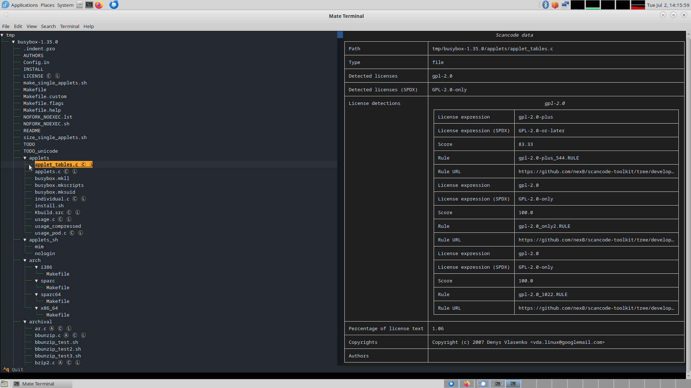

# Scancode license TUI

This is a (work in progress) text user interface (TUI) for processing results
of [ScanCode][scancode]. It is written in Python and based on [Rich][rich]. It
can display results of recent versions of ScanCode, there is no backward
compatibility mode.

This is not meant as a full replacement for other tools processing ScanCode
results, but as a quick inspection tool.

An example file to test with can be found in the `data` directory.

## Using the tool

First you need to make sure you have the dependencies installed, see
`requirements.txt` (or `shell.nix` for those using Nix). The dependencies
are modest.

After running ScanCode simply supply the path of the JSON result file:

```console
$ python scancode_license_tui.py -j /path/to/result/json
```

for example if the result is found in a file `/tmp/busybox.json`:

```console
$ python scancode_license_tui.py -j /tmp/busybox.json
```

To display only results that ScanCode found use the `--results-only` flag:

```console
$ python scancode_license_tui.py -j /path/to/result/json --results-only
```

Quiting the tool: CTRL-q



# Scancode pretty printer

To print some of the results there is also a fairly similar script that can
print a decorated file tree as well as the results table per file, similar to
the ones from the TUI.

To print a tree:

```console
$ python scancode_license_pp.py print-tree -j /path/to/result/json
```

for example:

```console
$ python scancode_license_pp.py print-tree -j /tmp/busybox.json
```

To print the tables with results (1 per file):

```console
$ python scancode_license_pp.py print-results -j /path/to/result/json
```

for example:

```console
$ python scancode_license_pp.py print-results -j /tmp/busybox.json
```

To reduce the size of the output when pretty printing the individual tables the
`--results-only` flag can be used.

To ignore values (so they are not printed) the `--ignore` flag can be used.
This flag can be used multiple times to ignore multiple values. Currently the
following values can be ignored:

* authors
* copyrights
* copyright holders
* license detections
* percentage of license text

```console
$ python scancode_license_pp.py print-results -j /tmp/busybox.json --ignore=authors --ignore=percentage
```

[scancode]:https://github.com/nexB/scancode-toolkit
[rich]:https://github.com/Textualize/rich
